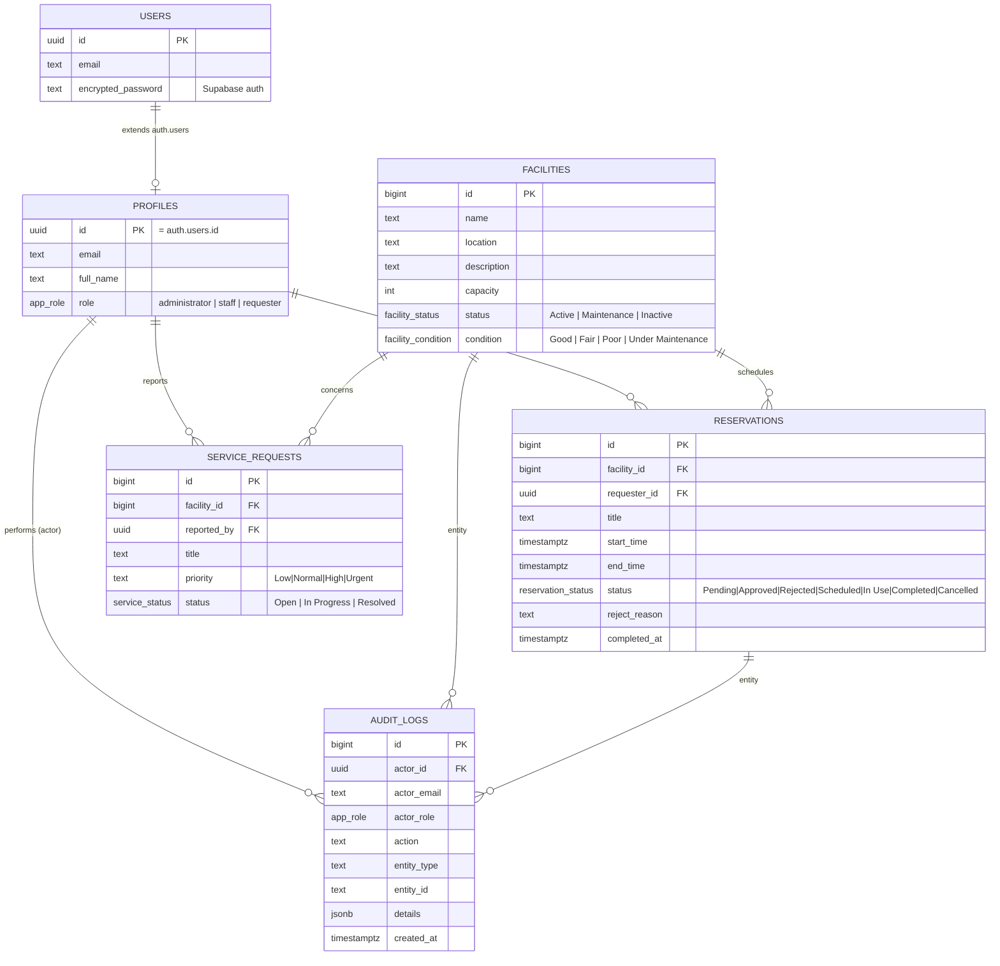

# ERD — Facility Reservation & Service Request Management System

Entity-relationship design implemented in `supabase/schema.sql` (Supabase Postgres).

## Notes
- `reservations.status` implements **BR-B4-05/06/07**: transitions are validated by the trigger
  `validate_reservation_transition()`, overlapping active slots are blocked by
  `check_reservation_conflict()` (BR-B4-03).
- `facilities.status = 'Maintenance'` blocks reservation inserts (BR-B4-08) via the same trigger.
- Every critical action writes an `audit_logs` row (BR-B4-10); admin reads them through
  `get_audit_logs()` which refuses non-admin callers.