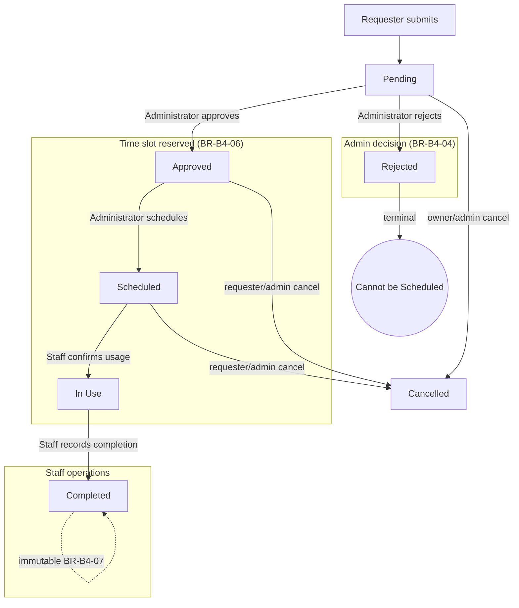

# Reservation Workflow

Statuses implemented: **Pending, Approved, Rejected, Scheduled, In Use, Completed, Cancelled**.

## Transition table (enforced by `validate_reservation_transition()`)

| From        | → Allowed                                   | → Blocked                 |
|-------------|---------------------------------------------|---------------------------|
| Pending     | Approved, Rejected, Cancelled               | Scheduled, In Use, Completed |
| Approved    | Scheduled, Cancelled                        | Rejected, Completed       |
| Scheduled   | In Use, Cancelled                           | Approved, Rejected        |
| In Use      | Completed                                   | anything else             |
| Rejected    | (none)                                      | any change, **incl. Scheduled (BR-B4-05)** |
| Completed   | (none)                                      | **any edit/delete (BR-B4-07)** |
| Cancelled   | (none)                                      | any change                |